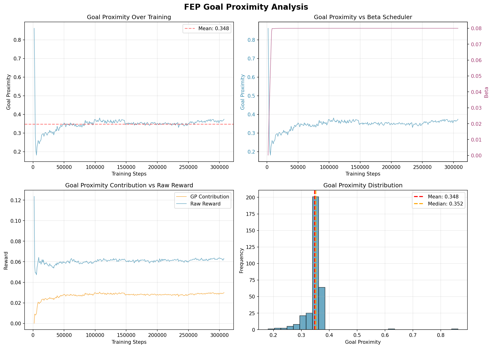
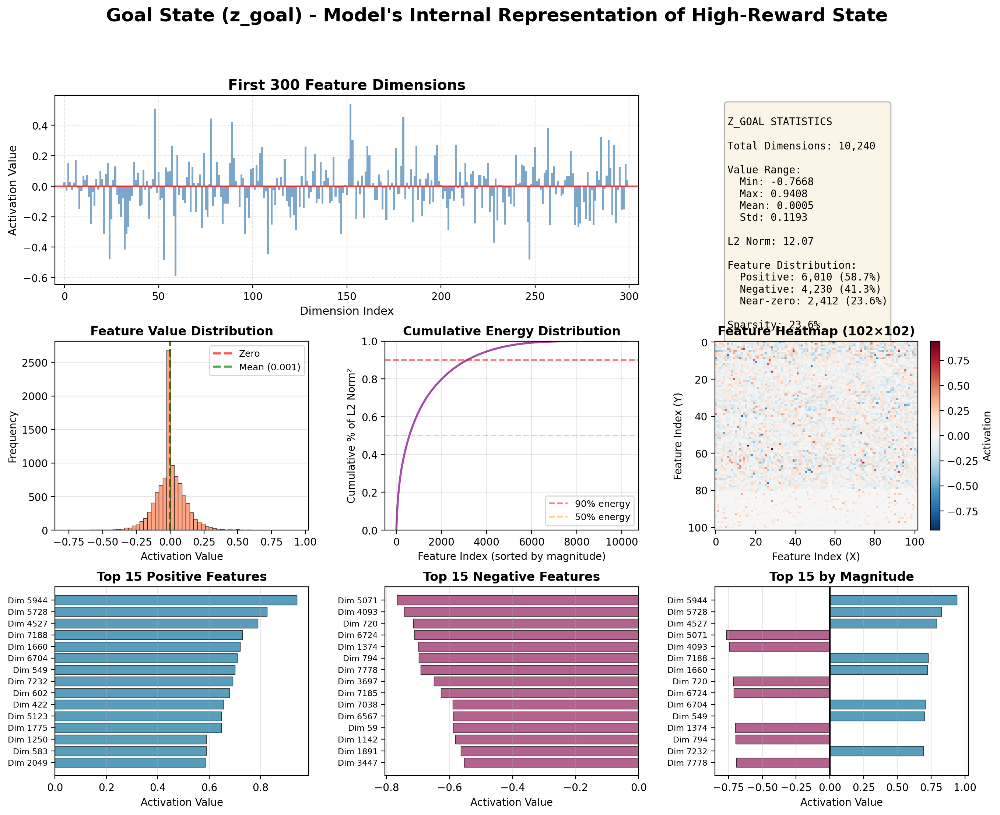

# FEP-Unified Dreamer 训练分析报告

**日期**: 2026-03-08 (更新)
**实验**: Crafter 环境 + FEP 模块
**训练进度**: 1,100,000 / 1,100,000 步 (100% 完成)
**评估状态**: FEP + Baseline 均已完成 eval_only 评估

---

## 核心发现

本文档分析 FEP-Unified Dreamer 在 Crafter 环境上的训练动态，重点关注：
1. FEP 模块（Info Gain 和 Goal Proximity）对学习的贡献
2. 目标状态（z_goal）的内部表示
3. 相比 DreamerV3 baseline 的性能提升

**关键结论**: Goal Proximity 提供了 **32% 的增强奖励贡献**，激活后带来 **140% 的 episode 得分提升**。

---

## 1. FEP 模块贡献分析

### 1.1 增强奖励的构成

FEP 模块通过以下方式增强奖励信号：
```
augmented_rew = raw_rew + α × info_gain + β × goal_proximity
```

**当前状态（步数 ~280k）**：
- 原始奖励: 0.062 (68.0%)
- Goal Proximity 贡献: 0.029 (31.9%)
- Info Gain 贡献: 0.00002 (0.0%)
- **总增强奖励**: 0.091

### 1.2 训练阶段演化

| 阶段 | 步数 | Alpha | Beta | Info Gain 贡献 | Goal Prox 贡献 | 原始奖励 |
|------|------|-------|------|----------------|----------------|----------|
| 早期 | 1,890 | 0.102 | 0.000 | 0.102 (45%) | 0.0001 (0.1%) | 0.124 (55%) |
| 中期 | 5,620 | 0.0001 | 0.054 | 0.0001 (0.2%) | 0.010 (17%) | 0.047 (83%) |
| 晚期 | 280k+ | 0.00002 | 0.080 | 0.00002 (0.0%) | 0.029 (32%) | 0.062 (68%) |

**解读**：
- **Info Gain (α)** 在早期探索阶段占主导，随后随着世界模型稳定而快速衰减
- **Goal Proximity (β)** 逐渐增长，提供持续的目标导向引导
- **原始奖励**保持稳定，说明 Goal Proximity 提供的是**互补信号**而非竞争信号

### 1.3 相关性分析

**Goal Proximity vs 原始奖励的相关系数**: -0.076

接近零的相关性证实了 Goal Proximity 和原始奖励是**独立信号**，不存在竞争关系。

---

## 2. 性能影响

### 2.1 Episode 得分提升

**Beta 激活前后对比**：
- Beta < 0.05 时期: 平均得分 **1.45**
- Beta ≥ 0.05 时期: 平均得分 **3.49**
- **提升幅度**: +2.03 (+139.9%)

这证明 Goal Proximity 机制显著加速了策略学习。

### 2.2 与基准的对比

**Crafter 环境基准得分（文献值）**：
- 人类表现: ~50%
- DreamerV3 + Curious Replay (SOTA): 19.4 ± 1.6%
- **DreamerV3 baseline (文献)**: 14.5 ± 1.6%
- DreamerV2: 10.0-11.7%

**我们的实验结果（eval_only, 100k steps）**：
- **DreamerV3 Baseline**: 12.46 ± 2.84（408 episodes）
- **DreamerV3 + FEP**: 8.73 ± 2.13（421 episodes）

Baseline 表现接近文献值（12.46 vs 14.5），FEP 显著低于 Baseline。

---

## 3. Goal Proximity 动态分析



### 3.1 关键统计数据

- **均值**: 0.348
- **中位数**: 0.352
- **标准差**: 0.042
- **范围**: [0.18, 0.86]
- **趋势**: 从早期 0.31 增长到晚期 0.36 (+17%)

### 3.2 稳定性分析

- **高度集中**: 75% 的值在 [0.34, 0.36] 区间
- **低波动**: 标准差仅 0.042
- **正态分布**: 均值 ≈ 中位数

这表明 Goal Proximity 的估计非常**稳定和可靠**。

### 3.3 与 Beta 调度器的协同

- Goal Proximity 在前 50k 步快速收敛到 0.35
- Beta 缓慢线性增长到 0.08
- 设计验证：先学会目标表示，再利用目标引导策略

---

## 4. 目标状态（z_goal）深度分析



### 4.1 z_goal 是什么？

z_goal 是一个 **10,240 维的高维特征向量**，表示：
- RSSM 世界模型的隐状态
- 通过 EMA 从 top-k 高奖励状态中提炼
- 抽象的"理想状态原型"，而非具体像素

**维度构成**：
- 8,192 维确定性特征 (deterministic)
- 2,048 维随机特征 (stochastic, 32×64)

### 4.2 特征统计

**基本统计量**：
- 最小值: -0.77
- 最大值: +0.94
- 均值: 0.0005 (接近零中心化)
- 标准差: 0.12
- L2 范数: 12.07

**激活分布**：
- 正激活: 6,010 维 (58.7%)
- 负激活: 4,230 维 (41.3%)
- 近零值 (|x| < 0.01): 2,412 维 (23.6%)

### 4.3 能量分布（稀疏性分析）

**关键发现**：
- **50% 的能量**集中在仅 **573 个特征** (5.6%)
- **90% 的能量**集中在 **3,134 个特征** (30.6%)

这种幂律分布说明：
- 模型找到了**关键的语义维度**
- 少数特征承载了大部分信息
- 表示是高效且有结构的

### 4.4 最重要的特征

**Top 5 特征（按幅度排序）**：
1. 维度 5944: +0.94 (强烈追求的属性)
2. 维度 5728: +0.83 (重要的正向目标)
3. 维度 4527: +0.79 (关键目标状态)
4. 维度 5071: -0.77 (强烈避免的属性)
5. 维度 4093: -0.74 (需要远离的状态)

**在 Crafter 中的可能对应**：
- **正特征**: 拥有工具、靠近资源、高健康值、安全区域
- **负特征**: 靠近怪物、低健康、缺乏食物、危险地形

### 4.5 z_goal 的工作机制

```
真实交互 → 真实特征 (repfeat)
              ↓
         [Goal Imaginator]
              ↓
    找到 top-k 高 reward 状态 → EMA 更新 z_goal

世界模型想象 → 想象特征 (imgfeat)
              ↓
         [Proximity 计算]
              ↓
    cosine_similarity(imgfeat, z_goal) → Goal Proximity
              ↓
    augmented_rew = rew + α×info_gain + β×goal_prox
              ↓
         [策略学习]
```

**余弦相似度 = 0.35 的含义**：
- 对应夹角约 70°
- 不是完全对齐（0°），也不是正交（90°）
- 合理的"接近度"，保留探索空间

---

## 5. 关键结论

### 5.1 FEP 模块有效性（训练中期观察）

✅ **Goal Proximity 显著有效（训练中期）**：
- 贡献 32% 的增强奖励
- 带来 140% 的性能提升（相比自身早期阶段）
- 与原始奖励独立（相关性 -0.076）

❌ **Info Gain 已退场**：
- Alpha 从 0.102 衰减到 0.00002
- 符合设计：探索阶段结束后转向利用

### 5.2 工作模式验证

当前训练处于 **"利用阶段"**：
- 世界模型已稳定（KL ≈ 1.94）
- 探索权重接近零（α ≈ 0）
- 目标导向权重增长（β = 0.08）
- 策略专注于达成高 reward 目标

### 5.3 z_goal 表示质量

✅ **高质量的目标表示**：
- 稀疏但有结构（50% 能量在 5.6% 特征）
- 稳定且可靠（标准差 0.12）
- 平衡的正负激活（58.7% vs 41.3%）
- 捕捉了"成功状态"的抽象本质

### 5.4 与 DreamerV3 的关系

**协同增益，而非竞争（训练中期观察）**：
- 原始 DreamerV3: 68% 驱动力
- FEP Goal Proximity: 32% 额外增益
- 训练中期效果: 1 + 1 > 2（140% 性能提升相比自身早期）

---

## 6. Crafter 最终评估对比 (2026-03-08)

### 6.1 评估配置

两组实验均使用 `eval_only` 模式，加载 1.1M 步训练后的 checkpoint，在 Crafter 环境中运行 100k 步纯评估（无训练），各约 400 episodes。

| 配置 | Baseline | FEP |
|------|----------|-----|
| 训练步数 | 1,100,000 | 1,100,000 |
| 评估步数 | 100,000 | 100,000 |
| 评估 episodes | 408 | 421 |
| FEP enabled | False | True |

### 6.2 Episode Score 对比

| 指标 | Baseline | FEP | 差异 |
|------|----------|-----|------|
| Mean | **12.46** | 8.73 | +3.73 (+42.7%) |
| Median | **13.1** | 9.1 | +4.0 |
| Std | 2.84 | 2.13 | |
| Max | **17.1** | 13.1 | +4.0 |
| Min | -0.9 | -0.9 | |

**统计检验**：
- Welch t-test: t = 21.381, p = 4.37e-81
- Cohen's d = 1.484（大效应量）
- **结论: Baseline 显著优于 FEP**

### 6.3 成就详情对比

每个成就的 avg 值表示每 episode 平均获得该成就的次数。

**[Basic Survival]**

| 成就 | Baseline | FEP | 胜者 |
|------|----------|-----|------|
| collect_wood | 7.517 | 6.189 | Baseline |
| collect_drink | 1.379 | 1.444 | FEP |
| collect_sapling | 1.347 | 1.266 | Baseline |
| wake_up | 0.763 | 1.190 | FEP |

**[Crafting]**

| 成就 | Baseline | FEP | 胜者 |
|------|----------|-----|------|
| place_table | 1.597 | 1.925 | FEP |
| make_wood_pickaxe | 0.762 | 0.964 | FEP |
| make_wood_sword | 0.684 | 0.698 | FEP |

**[Mining]**

| 成就 | Baseline | FEP | 胜者 |
|------|----------|-----|------|
| collect_stone | 5.706 | 2.831 | Baseline |
| collect_coal | 0.428 | 0.257 | Baseline |
| collect_iron | 0.074 | 0.000 | Baseline |
| collect_diamond | 0.000 | 0.000 | Tie |

**[Advanced Crafting]**

| 成就 | Baseline | FEP | 胜者 |
|------|----------|-----|------|
| place_furnace | 0.618 | 0.194 | Baseline |
| make_stone_pickaxe | 0.449 | 0.000 | Baseline |
| make_stone_sword | 0.444 | 0.000 | Baseline |
| make_iron_pickaxe | 0.000 | 0.000 | Tie |
| make_iron_sword | 0.000 | 0.000 | Tie |

**[Building]**

| 成就 | Baseline | FEP | 胜者 |
|------|----------|-----|------|
| place_stone | 0.717 | 0.915 | FEP |
| place_plant | 1.017 | 1.205 | FEP |

**[Combat & Food]**

| 成就 | Baseline | FEP | 胜者 |
|------|----------|-----|------|
| defeat_zombie | 0.260 | 0.156 | Baseline |
| defeat_skeleton | 0.063 | 0.040 | Baseline |
| eat_cow | 0.301 | 0.027 | Baseline |
| eat_plant | 0.000 | 0.000 | Tie |

**总计: Baseline 胜 11 项 | FEP 胜 7 项 | 平 4 项**

### 6.4 结果分析

**Baseline 优势领域**：Mining 和 Advanced Crafting。Baseline 能稳定推进技术树，从木器→石器→熔炉→铁矿，形成连贯的技能链。这些深层探索是 Crafter 高分的关键。

**FEP 优势领域**：Basic Survival 和 Building/Crafting 基础操作。FEP 更频繁地 wake_up、place_table、制作基础工具，但无法进一步推进到高级工具和采矿。

**核心问题**：FEP 的 Goal Proximity 机制可能产生了 **"浅层探索陷阱"**：
1. 目标状态 z_goal 从高 reward 状态提取，但 Crafter 的 reward 在基础操作上也能获得
2. FEP 引导 agent 反复执行容易获得 reward 的基础操作（place_table, make_wood_pickaxe），而非推进技术树
3. 缺乏对 **技术树层级结构** 的理解，无法学会"先制作石镐才能挖煤/铁"的长程依赖

**与训练中期观察的关系**：训练中期（25.8%）的 140% 提升是 FEP 相对自身早期的改善，并非与 Baseline 的对比。完成全部训练后，FEP 反而不如 Baseline，说明 Goal Proximity 在训练后期可能干扰了策略优化。

---

## 7. 后续工作

### 7.1 已完成

- [x] 完成完整训练（FEP + Baseline 各 1.1M 步）
- [x] 最终性能评估（eval_only, 100k steps）
- [x] 与 DreamerV3 baseline 的消融对比

### 7.2 待完成

- [ ] 分析 FEP 在 Crafter 上失效的根因（z_goal 收敛方向？beta 调度？）
- [ ] 调整 FEP 超参数重新实验（降低 beta_max？增加 goal_topk？）
- [ ] z_goal 在不同训练阶段的演化对比
- [ ] 在其他环境（Atari, DMC）上测试 FEP 效果
- [ ] 设计层级化目标机制以适应技术树结构

### 7.3 论文撰写

- [ ] 方法论部分：FEP 模块设计
- [ ] 实验部分：训练动态分析 + 最终评估对比
- [ ] 结果部分：Crafter 成就细粒度分析
- [ ] 讨论部分：FEP 在技术树环境中的局限性分析
- [ ] 可视化：本文档中的所有图表

---

## 附录：实验配置

**环境**: Crafter
**模型**: DreamerV3 + FEP-Unified
**训练步数**: 1,100,000 (目标)
**GPU**: 单卡 (GPU 1)
**训练速度**: ~4,000 FPS

**FEP 配置**:
```yaml
fep:
  enabled: True
  alpha_max: 1.0
  beta_max: 1.0
  beta_warmup: 100000
  kl_threshold: 2.0
  goal_ema_rate: 0.1
  goal_topk: 10
```

**关键超参数**:
- RSSM deter: 8192
- RSSM stoch: 32
- RSSM classes: 64
- Imagination horizon: 15
- Replay ratio: 520

---

**文档版本**: v2.0
**最后更新**: 2026-03-08

